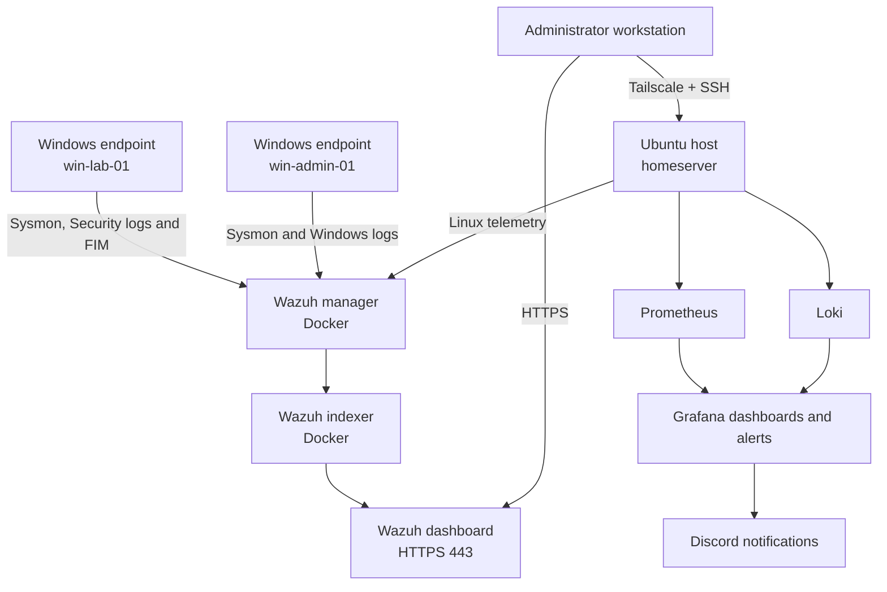

# Home SOC Lab: Wazuh SIEM, Endpoint Detection and Observability

An independently designed home security monitoring lab built on repurposed enterprise hardware. The project combines Wazuh endpoint detection with Prometheus metrics, Loki logs, Grafana dashboards and tested alert delivery.

The repository is a living technical record. It documents not only what was deployed, but also how each component was validated and what security trade-offs remain.

## Project status

**Current phase:** Core SOC and observability platforms operational; endpoint monitoring, detection, backup and infrastructure alerting validated.

- Ubuntu Server installed and hardened for remote administration
- Stable LAN addressing configured through DHCP reservation
- Secure remote access implemented with Tailscale
- Docker Engine and Docker Compose installed and validated
- Wazuh 4.14.7 single-node stack deployed in containers
- Default Wazuh service credentials replaced
- Two Windows endpoints and the Ubuntu host enrolled and reporting normally
- Microsoft Sysmon configured on both Windows endpoints for process and network telemetry
- Centralised Wazuh policy distributing Sysmon log collection
- End-to-end detections validated in Wazuh Threat Hunting
- Custom Wazuh rule authored, syntax-tested and triggered successfully
- File Integrity Monitoring validated for creation, modification and deletion
- Who-data attribution verified with responsible user, process, hashes and content diff
- Windows failed logons investigated and correlated into a level-10 brute-force alert
- CIS Windows 10 SCA baseline established and one lockout-policy finding remediated
- Wazuh ports restricted to required LAN interfaces; indexer and API ports removed from host exposure
- Tailscale Serve configured for encrypted, tailnet-only dashboard access
- Weekly checksum-verified Wazuh backups automated with a systemd timer
- Grafana, Prometheus, Loki, Alloy, Node Exporter and cAdvisor deployed as a separate observability stack
- Six Prometheus scrape targets validated; Ubuntu and container dashboards operational
- Critical target-availability alert connected to Discord and tested through firing and recovery

## What this project demonstrates

- Linux server deployment and administration
- Network configuration and service exposure decisions
- Encrypted remote access without public SSH port forwarding
- Docker Compose operations and container troubleshooting
- SIEM architecture and endpoint onboarding
- Windows Event Channel and Sysmon telemetry collection
- Detection triage using process ancestry, user context and command lines
- MITRE ATT&CK interpretation and false-positive analysis
- Custom-rule development and existing-coverage assessment
- File Integrity Monitoring and Windows Who-data auditing
- Authentication-event triage and threshold-based correlation
- CIS benchmark assessment and risk-aware remediation
- Host and container metrics collection with PromQL-backed dashboards
- Centralised journald and Docker log exploration with Loki
- Alert lifecycle validation: pending, firing, notification, recovery and resolved state
- Backup automation, integrity verification and controlled service recovery
- Secure handling of service credentials and configuration
- Clear implementation documentation and repeatable validation

## Architecture



## Technology stack

| Layer | Technology |
|---|---|
| Hardware | HP ProLiant DL360p Gen8, Xeon E5-2643, 48 GB ECC RAM |
| Host OS | Ubuntu Server 24.04 LTS |
| Storage | HP Smart Array P420i, approximately 558 GB logical disk |
| Container platform | Docker Engine and Docker Compose |
| SIEM | Wazuh 4.14.7 single-node deployment |
| Endpoint telemetry | Wazuh Agent 4.14.7 and Microsoft Sysmon |
| Metrics | Prometheus, Node Exporter and cAdvisor |
| Logs | Loki and Grafana Alloy |
| Dashboards and alerting | Grafana with Discord contact point |
| Remote administration | OpenSSH and Tailscale |
| Host firewall | UFW |
| Endpoints | Windows 10, Windows 11 and Ubuntu Server |

## Repository structure

```text
home-siem-lab/
├── README.md
├── SECURITY.md
├── docs/
│   ├── 01-infrastructure.md
│   ├── 02-secure-remote-access.md
│   ├── 03-wazuh-deployment.md
│   ├── 04-windows-endpoint-and-sysmon.md
│   ├── 05-validation-and-findings.md
│   ├── 06-detection-engineering-and-fim.md
│   ├── 07-authentication-monitoring.md
│   ├── 08-security-configuration-assessment.md
│   ├── 09-roadmap.md
│   ├── 10-progress-checklist.md
│   └── 11-observability-alerting-and-resilience.md
├── config/
│   ├── sysmon-minimal.xml
│   ├── wazuh-windows-sysmon-agent.conf
│   └── local_rules.xml
└── evidence/
    └── README.md
```

## Key implementation decisions

1. **No direct SSH exposure to the internet.** Remote administration uses Tailscale rather than router port forwarding.
2. **Containerised Wazuh deployment.** The manager, indexer and dashboard are separated into reproducible Docker services.
3. **Centralised agent configuration.** Windows Sysmon collection is assigned through a dedicated `windows-sysmon` Wazuh group.
4. **Start with high-value telemetry.** The initial Sysmon policy captures process creation and network connections before adding noisier event types.
5. **Evidence-driven validation.** Every layer was tested independently before continuing to the next integration.
6. **Avoid duplicate detections.** A proposed encoded-PowerShell rule was removed after stronger built-in coverage was confirmed.
7. **Risk-aware remediation.** CIS findings are evaluated before configuration changes are applied.
8. **Separate monitoring stack.** Observability services run in their own Compose project so Wazuh and infrastructure monitoring can be operated independently.
9. **Test the full alert lifecycle.** Alerting was validated by intentionally stopping Node Exporter, receiving a critical Discord notification, restoring the service and confirming resolution.

## Current limitations

- The two physical disks are configured as RAID 0. This provides no redundancy; loss of either disk would destroy the array.
- The initial Sysmon policy is deliberately small and will require tuning and expansion.
- Backups currently remain on the server; an off-host copy and full restoration test are still required.
- Formal Wazuh index, Prometheus metric and Loki log retention targets require final review.
- The endpoints are lab systems and should not be used for unsafe testing outside an isolated environment.

## Planned work

- Copy verified backups to off-host storage and perform a documented restoration test
- Finalise Wazuh, Prometheus and Loki retention targets
- Expand and tune Sysmon coverage
- Add Windows Defender event collection
- Review Wazuh vulnerability findings
- Save analyst searches and write a concise incident report
- Develop incident investigation runbooks
- Add Suricata network monitoring
- Add diagrams and sanitised screenshots as evidence

## Documentation

- [Infrastructure and baseline](docs/01-infrastructure.md)
- [Secure remote access](docs/02-secure-remote-access.md)
- [Wazuh deployment](docs/03-wazuh-deployment.md)
- [Windows endpoint and Sysmon](docs/04-windows-endpoint-and-sysmon.md)
- [Validation and findings](docs/05-validation-and-findings.md)
- [Detection engineering and FIM](docs/06-detection-engineering-and-fim.md)
- [Authentication monitoring](docs/07-authentication-monitoring.md)
- [Security Configuration Assessment](docs/08-security-configuration-assessment.md)
- [Roadmap](docs/09-roadmap.md)
- [Progress checklist](docs/10-progress-checklist.md)
- [Observability, alerting and resilience](docs/11-observability-alerting-and-resilience.md)
- [Security and disclosure guidance](SECURITY.md)

## Author

**Jake Powell Langstaff**  
BSc (Hons) Cybersecurity & IT  
Career focus: SOC operations, incident response and security engineering
