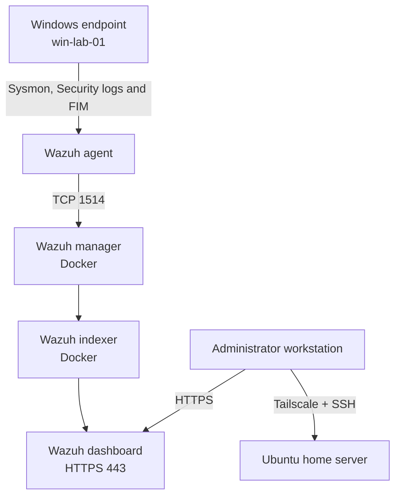

# Home SIEM Lab: Wazuh, Sysmon, Docker and Secure Remote Administration

An independently designed and implemented home security monitoring lab built on repurposed enterprise hardware. The project provides centralised endpoint telemetry, alerting, threat hunting and MITRE ATT&CK context using Wazuh and Microsoft Sysmon.

The repository is a living technical record. It documents not only what was deployed, but also how each component was validated and what security trade-offs remain.

## Project status

**Current phase:** Core platform operational; endpoint detection, FIM, authentication correlation and security assessment validated.

- Ubuntu Server installed and hardened for remote administration
- Stable LAN addressing configured through DHCP reservation
- Secure remote access implemented with Tailscale
- Docker Engine and Docker Compose installed and validated
- Wazuh 4.14.7 single-node stack deployed in containers
- Default Wazuh service credentials replaced
- Windows 10 endpoint enrolled and reporting normally
- Microsoft Sysmon configured for process and network telemetry
- Centralised Wazuh policy distributing Sysmon log collection
- End-to-end detections validated in Wazuh Threat Hunting
- Custom Wazuh rule authored, syntax-tested and triggered successfully
- File Integrity Monitoring validated for creation, modification and deletion
- Who-data attribution verified with responsible user, process, hashes and content diff
- Windows failed logons investigated and correlated into a level-10 brute-force alert
- CIS Windows 10 SCA baseline established and one lockout-policy finding remediated

## What this project demonstrates

- Linux server deployment and administration
- Network configuration and service exposure decisions
- Encrypted remote access without public SSH port forwarding
- Docker Compose operations and container troubleshooting
- SIEM architecture and endpoint onboarding
- Windows Event Channel and Sysmon telemetry collection
- Detection triage using process ancestry, user context and command lines
- MITRE ATT&CK interpretation and false-positive analysis
- Custom-rule development and existing-coverage assessment
- File Integrity Monitoring and Windows Who-data auditing
- Authentication-event triage and threshold-based correlation
- CIS benchmark assessment and risk-aware remediation
- Secure handling of service credentials and configuration
- Clear implementation documentation and repeatable validation

## Architecture



## Technology stack

| Layer | Technology |
|---|---|
| Hardware | HP ProLiant DL360p Gen8, Xeon E5-2643, 48 GB ECC RAM |
| Host OS | Ubuntu Server 24.04 LTS |
| Storage | HP Smart Array P420i, approximately 558 GB logical disk |
| Container platform | Docker Engine and Docker Compose |
| SIEM | Wazuh 4.14.7 single-node deployment |
| Endpoint telemetry | Wazuh Agent 4.14.7 and Microsoft Sysmon |
| Remote administration | OpenSSH and Tailscale |
| Host firewall | UFW |
| Endpoint | Windows 10 Pro lab workstation |

## Repository structure

```text
home-siem-lab/
├── README.md
├── SECURITY.md
├── docs/
│   ├── 01-infrastructure.md
│   ├── 02-secure-remote-access.md
│   ├── 03-wazuh-deployment.md
│   ├── 04-windows-endpoint-and-sysmon.md
│   ├── 05-validation-and-findings.md
│   ├── 06-detection-engineering-and-fim.md
│   ├── 07-authentication-monitoring.md
│   ├── 08-security-configuration-assessment.md
│   ├── 09-roadmap.md
│   └── 10-progress-checklist.md
├── config/
│   ├── sysmon-minimal.xml
│   ├── wazuh-windows-sysmon-agent.conf
│   └── local_rules.xml
└── evidence/
    └── README.md
```

## Key implementation decisions

1. **No direct SSH exposure to the internet.** Remote administration uses Tailscale rather than router port forwarding.
2. **Containerised Wazuh deployment.** The manager, indexer and dashboard are separated into reproducible Docker services.
3. **Centralised agent configuration.** Windows Sysmon collection is assigned through a dedicated `windows-sysmon` Wazuh group.
4. **Start with high-value telemetry.** The initial Sysmon policy captures process creation and network connections before adding noisier event types.
5. **Evidence-driven validation.** Every layer was tested independently before continuing to the next integration.
6. **Avoid duplicate detections.** A proposed encoded-PowerShell rule was removed after stronger built-in coverage was confirmed.
7. **Risk-aware remediation.** CIS findings are evaluated before configuration changes are applied.

## Current limitations

- The two physical disks are configured as RAID 0. This provides no redundancy; loss of either disk would destroy the array.
- The Wazuh dashboard currently uses a locally generated certificate, so browsers display a trust warning.
- The initial Sysmon policy is deliberately small and will require tuning and expansion.
- Off-host backups and formal alert/index retention policies have not yet been implemented.
- The endpoint is a lab Windows 10 system and should not be used for unsafe testing outside an isolated environment.

## Planned work

- Establish off-host backups for configuration and Wazuh data
- Define index retention and storage monitoring
- Verify the post-remediation SCA score
- Expand and tune Sysmon coverage
- Add Windows Defender event collection
- Review Wazuh vulnerability findings
- Save analyst searches and write a concise incident report
- Add a Linux endpoint and compare telemetry
- Develop incident investigation runbooks
- Add Suricata network monitoring
- Add diagrams and sanitised screenshots as evidence

## Documentation

- [Infrastructure and baseline](docs/01-infrastructure.md)
- [Secure remote access](docs/02-secure-remote-access.md)
- [Wazuh deployment](docs/03-wazuh-deployment.md)
- [Windows endpoint and Sysmon](docs/04-windows-endpoint-and-sysmon.md)
- [Validation and findings](docs/05-validation-and-findings.md)
- [Detection engineering and FIM](docs/06-detection-engineering-and-fim.md)
- [Authentication monitoring](docs/07-authentication-monitoring.md)
- [Security Configuration Assessment](docs/08-security-configuration-assessment.md)
- [Roadmap](docs/09-roadmap.md)
- [Progress checklist](docs/10-progress-checklist.md)
- [Security and disclosure guidance](SECURITY.md)

## Author

**Jake Powell Langstaff**  
BSc (Hons) Cybersecurity & IT  
Career focus: SOC operations, incident response and security engineering
